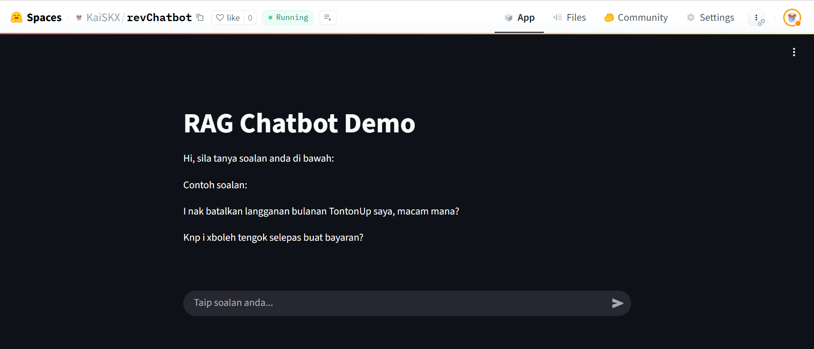
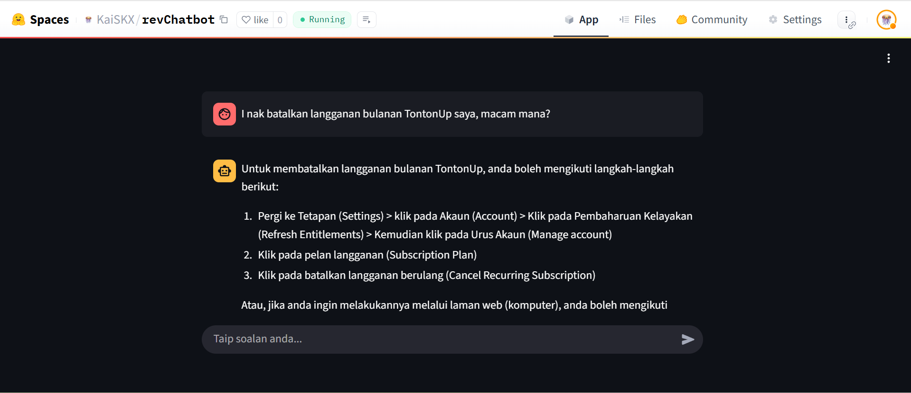
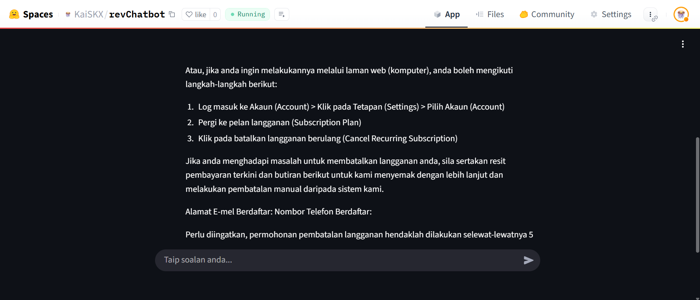

## What I Built

This project is a Retrieval-Augmented Generation (RAG) chatbot, hosted on [Hugging Face Spaces](https://huggingface.co/spaces/KaiSKX/revChatbot). The chatbot uses open source LLMs from Hugging Face, not closed LLM service providers (which require payment). 

Instead of using the Hugging Face `transformers` library (which requires downloading large LLMs to local disk and need GPU), I use the Hugging Face Inference Client API. This allows me to run everything on CPU and easily switch between different LLMs on Hugging Face for testing, without downloading huge size models. Both the embedding model and the LLM are accessed via the Inference Client.

## Challenges & Solutions

- **Limited Free Quota:** Hugging Face gives free users $0.10 every month credit for the Inference Client. I have already used $0.09 for debugging and testing with different LLMs, so the provided Hugging Face Space may only work for a few more requests. Luckily, the quota $0.10 will refresh on August 1st.
- **Model Size and Speed:** Large parameter open source LLMs are slow to generate each response, especially without a GPU. This makes debugging and testing more time-consuming.
- **Switching Models:** I also want to try different LLMs and embedding models easily, so using the Inference Client was ideal for this case for just demo.
- **Document Splitting:** Initially, I used fixed-length chunking with overlap, but the results were not satisfied. I switched to splitting each Q&A pair as a chunk, which works much better.
- **Hyperlinks in Documents:** The document contains hyperlinks (ex: reset website). So, I converted them to full https links before embedding and also let LLM to proceed, hence the LLM can process and generate them as part of the answer without information loss.

## Example Dialogues

Screenshots of conversations:







## Setup & Usage (GitHub Repo)

- The provided `Dockerfile` is specific for Hugging Face Spaces deployment.
- To run locally (without Docker):
```bash
git clone https://github.com/kaifeng-cmd/revChat
cd revChat
python -m venv venv
venv\Scripts\activate #for Windows
pip install -r requirements.txt
streamlit run app/main.py
```

- You will need to create a `.env` file in the project root with your own Hugging Face token:

```
HF_TOKEN="your_huggingface_token"
```

  (You can get free token from your Hugging Face account settings.)

- The open source LLM I used is: `meta-llama/Llama-3.1-8B-Instruct`
- Both text embedding model and LLM are accessed via the Hugging Face Inference Client API.
- The embeddings are stored in file-based vector database `ChromaDB`

## Design Notes

- **Document Splitting:** Each Q&A pair is treated as a chunk for embedding, which is more effective for FAQ-style documents than fixed-length chunking.
- **Hyperlinks:** Any hyperlinks in the document are expanded to full URLs so the LLM can generate them in answers.

## Future Work

- **UI Improvements:** For a more beautiful UI, consider using HTML/CSS/JS to make generated https links clickable (formatting as buttons or hyperlinks) in the chat interface to avoild lengthly https link.
- **Prompt Engineering:** With more quota, further tuning of prompts could improve answer accuracy and structure.
- **Switch to Closed LLM APIs:** For stronger capabilities, consider using closed LLM APIs (e.g., OpenAI, Anthropic). The drawback is cost compared to open source models.
- **More Robust Testing:** Due to quota limits, I could not do extensive debugging and testing more. With more credits, more thorough testing and improvements are possible.

---

Note: This project is a demo to showcase RAG chatbot logic and UI. Because of my free quota limit, the Hugging Face Space I provided may not always be available for testing.
